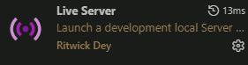
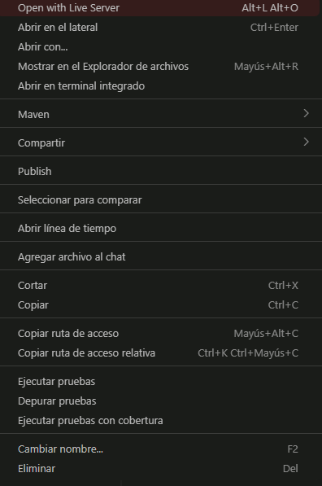

# Chachara
**Proyecto Semestral - Diseño de Aplicaciones Web**

*IDS 6to Semestre*

Este proyecto busca realizar un **juego online** interactivo inspirado por el juego de mesa *Pictionary* en donde un grupo de personas intentan dibujar la oración o palabra dada.

<p align="center">

</p>

--- 
## Descripción
Cháchara es un juego multijugador en línea inspirado en _Pictionary_, donde los participantes compiten por **identificar palabras y frases basándose en dibujos creados en tiempo real**. Un jugador es designado para hacer un dibujo que represente la palabra o frase asignada, mientras que los demás jugadores se esfuerzan por adivinar el contenido antes de que expire el límite de tiempo. 

Entre las funcionalidades proyectadas se encuentran: salas de juego con código de acceso, dibujo colaborativo en tiempo real, y selección de avatar personalizable.

---
## Cómo ejecutar el proyecto localmente

### Prerrequisitos
- Java 21 instalado
- Gradle (viene incluido en el proyecto con gradlew)

### Pasos para ejecutar
1. **Configurar la base de datos:**
   
   Por defecto, el proyecto usa AWS (base de datos en la nube) por lo que no necesitas instalar PostgreSQL.
   
   Deberas crear un archivo `.env` en la carpeta `backend/`, puedes basarte en el [`.env.example`](https://github.com/chachara-dev/open-gartic/blob/dev/backend/.env.example).

2. **Ejecutar el backend:**
   
   Abre una terminal en la carpeta `backend` y ejecuta:
   
   ```bash
   .\gradlew bootRun
   ```

   El servidor se iniciará en `http://localhost:8080`.

3. **Ejecutar el frontend:**

   - Instala en *Visual Studio Code* la extensión **Live Server**:
   <p align="center">
   
   </p>
   
   - Haz **click derecho** sobre el archivo [`index.html`](https://github.com/chachara-dev/open-gartic/blob/dev/frontend/index.html) y selecciona *Open with Live Server*.
   <p align="center">
   
   </p>

El frontend automaticamente se conectará con el backend y levantará un servidor local.

---
## Herramientas utilizadas
###  Frontend
| Tecnología | Descripción |
|---|---|
| HTML5 | Estructura y contenido de las páginas |
| CSS3 | Estilos, animaciones y diseño responsivo |
| JavaScript | Lógica del cliente y conexión con la API |
| Google Fonts (Fredoka) | Tipografía principal del juego |

###  Backend
| Tecnología | Descripción |
|---|---|
| Java 21 | Lenguaje principal del servidor |
| Spring Boot 3 | Framework para la API REST |
| Spring Data JPA | Gestión y persistencia de datos |
| Spring Security + BCrypt | Autenticación y cifrado de contraseñas |
| Gradle | Gestor de dependencias y construcción del proyecto |

###  Base de datos
| Tecnología | Descripción |
|---|---|
| PostgreSQL | Base de datos relacional principal |
| dotenv-java | Gestión de variables de entorno para credenciales |

---
## Equipo
* **Michelle Anahi Lopez Diaz de Leon** : Frontend (_HTML, CSS y Javascript_)
* **Kevin Rucoba Moreno** : Backend (_Java, Springboot y dotenv_)
* **Jorge Eduardo Tello Castillo** : Infraestructura (_Base de datos, AWS e instancias_)
* **Emiliano Leos Beas** : Documentacion y diseño de business analysit (_UI/UX, Wireframes, Mockup_)
--- 
## Enlaces externos
- **Wireframe Figma:** https://www.figma.com/design/OxoXIyyLhqYFzbslmWAqEf/Wireframes-chachara?m=auto&t=ZrASgsQhgq7emuHd-6
